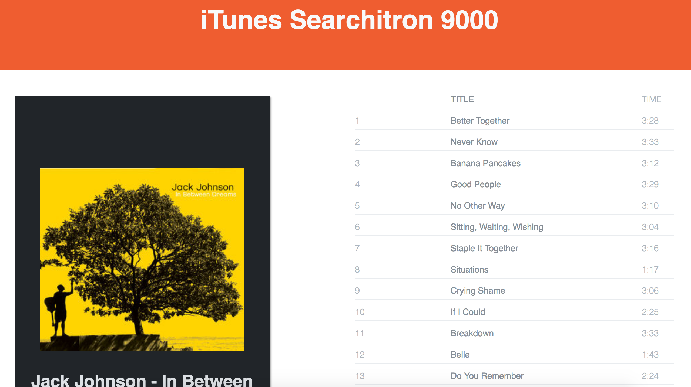

# _Itunes Searchitron 9000_

1.  **Clone the repo to your machine**

`git clone https://github.com/kevindavus/itunes-search.git`

2.  **Run the start command to start a hot reloading server.**

Npm: `npm start`

Yarn: `yarn start`

**_The server will be up on the port 8080 by default `localhost:8080`_**

3.  **for production**

Npm: `npm run build`

Yarn: `yarn run build`

After opening [the app](http://localhost:8080), type in your favorite artist

Check out their albums

Then take a look at what is on the album

**TODO**  
Make mobile friendly
